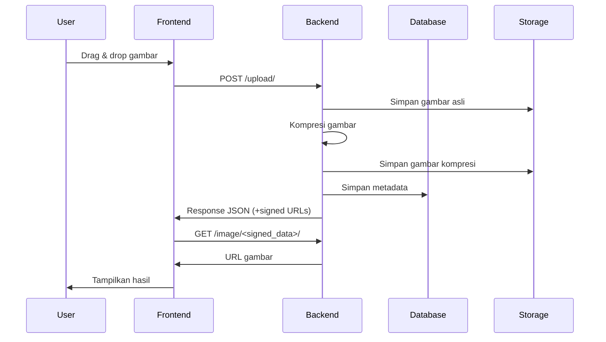

### Dokumentasi Aplikasi: Upload & Kompresi Gambar dengan Django

---

#### **1. Gambaran Umum**
Aplikasi ini memungkinkan pengguna untuk:
- Mengupload gambar melalui drag-and-drop atau file picker
- Mengkompresi gambar menjadi thumbnail 150px
- Menampilkan perbandingan visual antara gambar asli dan hasil kompresi
- Menyimpan metadata gambar ke database PostgreSQL
- Menggunakan signed URLs untuk keamanan akses file
- Menampilkan galeri semua gambar yang pernah diupload

---

#### **2. Teknologi yang Digunakan**
1. **Backend**:
   - Django 4.x
   - PostgreSQL
   - Pillow (untuk kompresi gambar)
   - Django FileSystemStorage

2. **Frontend**:
   - HTML5, CSS3, Vanilla JavaScript
   - Drag-and-drop API
   - XMLHttpRequest untuk upload file
   - Canvas API untuk preview gambar

3. **Infrastruktur**:
   - Database: PostgreSQL
   - Penyimpanan File: Sistem file lokal (dapat dikonfigurasi ke cloud storage)

---

#### **3. Struktur Proyek**
```
img/
├── imgs/
│   ├── migrations/          # Skema database
│   ├── templates/           # Template HTML
│   │   └── upload.html
│   ├── __init__.py
│   ├── admin.py             # Konfigurasi admin
│   ├── apps.py
│   ├── models.py            # Model database
│   ├── utils.py             # Fungsi kompresi gambar
│   ├── views.py             # Logika bisnis
│   └── urls.py              # Routing aplikasi
├── img/
│   ├── __init__.py
│   ├── settings.py          # Konfigurasi proyek
│   ├── urls.py              # Routing global
│   └── wsgi.py
├── media/                   # Penyimpanan file upload
│   ├── originals/           # Gambar asli
│   └── compressed/          # Hasil kompresi
└── manage.py                # Skrip pengelolaan
```

---

#### **4. Model Database (`models.py`)**
```python
class UploadedImage(models.Model):
    original_name = models.CharField(max_length=255)  # Nama file asli
    original_size = models.PositiveIntegerField()     # Ukuran file asli (bytes)
    compressed_size = models.PositiveIntegerField()   # Ukuran setelah kompresi
    original_url = models.URLField(max_length=500)    # URL gambar asli
    compressed_url = models.URLField(max_length=500)  # URL gambar kompresi
    created_at = models.DateTimeField(auto_now_add=True)  # Waktu upload
    
    # Properti tambahan untuk tampilan
    @property
    def original_size_kb(self):
        return round(self.original_size / 1024, 2)
    
    @property
    def compressed_size_kb(self):
        return round(self.compressed_size / 1024, 2)
    
    @property
    def reduction_percentage(self):
        return round((1 - self.compressed_size/self.original_size) * 100, 2)
```

---

#### **5. Proses Kompresi Gambar (`utils.py`)**
```python
def compress_image(image, max_width=150):
    img = Image.open(image)
    
    # Konversi format jika perlu
    if img.mode in ('RGBA', 'P'):
        img = img.convert('RGB')
    
    # Hitung dimensi baru
    width_percent = max_width / float(img.width)
    new_height = int(float(img.height) * float(width_percent))
    
    # Resize gambar
    img = img.resize((max_width, new_height), Image.LANCZOS)
    
    # Simpan ke buffer
    buffer = BytesIO()
    img.save(buffer, format='JPEG', quality=70, optimize=True)
    buffer.seek(0)
    
    # Buat file in-memory
    return InMemoryUploadedFile(
        buffer,
        'ImageField',
        f"{os.path.splitext(image.name)[0]}_compressed.jpg",
        'image/jpeg',
        buffer.getbuffer().nbytes,
        None
    )
```

---

#### **6. Alur Kerja Sistem**


---

#### **7. Endpoint API**
| Endpoint | Method | Deskripsi |
|----------|--------|-----------|
| `/` | GET | Halaman utama dengan form upload |
| `/upload/` | POST | Proses upload gambar |
| `/image/<str:signed_data>/` | GET | Dapatkan URL gambar melalui signed data |

---

#### **8. Konfigurasi Penting (`settings.py`)**
```python
# Database
DATABASES = {
    'default': {
        'ENGINE': 'django.db.backends.postgresql',
        'NAME': 'sevima',
        'USER': 'sevima',
        'PASSWORD': 'sevima',
        'HOST': 'localhost',
        'PORT': '5431',
    }
}

# Media files
MEDIA_URL = '/media/'
MEDIA_ROOT = os.path.join(BASE_DIR, 'media')

# Security (production)
SECURE_HSTS_SECONDS = 31536000  # 1 year
SECURE_SSL_REDIRECT = True
SESSION_COOKIE_SECURE = True
CSRF_COOKIE_SECURE = True
SECURE_BROWSER_XSS_FILTER = True

# File upload
DATA_UPLOAD_MAX_MEMORY_SIZE = 5242880  # 5MB
FILE_UPLOAD_MAX_MEMORY_SIZE = 5242880
```

---

#### **9. Cara Menjalankan Aplikasi**
1. **Setup lingkungan**:
   ```bash
   python -m venv venv
   source venv/bin/activate  # Linux/Mac
   venv\Scripts\activate    # Windows
   pip install django pillow psycopg2-binary
   ```

2. **Konfigurasi database**:
   - Buat database PostgreSQL
   - Update pengaturan di `settings.py`

3. **Migrasi database**:
   ```bash
   python manage.py makemigrations
   python manage.py migrate
   ```

4. **Jalankan server**:
   ```bash
   python manage.py runserver
   ```

5. **Akses aplikasi**:
   - Buka http://localhost:8000 di browser

---

#### **10. Pengujian Fitur**
1. **Upload Gambar**:
   - Drag & drop gambar ke area yang ditandai
   - Atau klik area untuk memilih file
   - Format yang didukung: JPG, PNG, GIF
   - Ukuran maksimal: 5MB

2. **Progress Bar**:
   - Menampilkan progres upload secara real-time
   - Berubah warna dari hijau saat komplit

3. **Hasil Kompresi**:
   - Gambar asli dan hasil kompresi ditampilkan berdampingan
   - Metadata ukuran file ditampilkan
   - Persentase pengurangan ukuran dihitung otomatis

4. **Galeri Gambar**:
   - Semua gambar yang pernah diupload ditampilkan
   - Tampilan grid responsif
   - Setiap item menampilkan gambar asli dan kompresi
   - Informasi ukuran dan persentase pengurangan

---

#### **11. Keamanan**
1. **Signed URLs**:
   - Setiap URL gambar di-sign dengan secret key
   - Masa berlaku: 1 jam
   - Menggunakan Django's signing module

2. **Validasi File**:
   - Hanya menerima file gambar (MIME type validation)
   - Batasan ukuran file (5MB)
   - Pengecekan ekstensi file

3. **CSRF Protection**:
   - Token CSRF digunakan pada semua POST request
   - Validasi otomatis oleh middleware Django

---

#### **12. Skalabilitas**
1. **Penyimpanan Cloud**:
   - Dapat dikonfigurasi ke Amazon S3, Google Cloud Storage
   - Gunakan django-storages package
   ```python
   # settings.py
   DEFAULT_FILE_STORAGE = 'storages.backends.s3boto3.S3Boto3Storage'
   AWS_ACCESS_KEY_ID = 'your-access-key'
   AWS_SECRET_ACCESS_KEY = 'your-secret-key'
   AWS_STORAGE_BUCKET_NAME = 'your-bucket-name'
   ```

2. **Caching**:
   - Gunakan Redis/Memcached untuk caching hasil query
   - Cache template fragment untuk galeri gambar

3. **Background Tasks**:
   - Gunakan Celery untuk proses kompresi berat
   - Mengurangi waktu respons server

---

#### **13. Troubleshooting**
| Masalah | Solusi |
|---------|--------|
| `relation "imgs_uploadedimage" does not exist` | Jalankan `python manage.py migrate` |
| File tidak tersimpan | Pastikan folder `media/` ada dan writable |
| Upload gagal | Periksa ukuran file dan format |
| Gambar tidak muncul | Periksa konfigurasi MEDIA_URL dan MEDIA_ROOT |
| Signed URL tidak valid | Periksa masa berlaku (max_age=3600) |

---

#### **14. Pengembangan Lebih Lanjut**
1. **Fitur Potensial**:
   - Kustomisasi ukuran kompresi
   - Multiple file upload
   - Edit gambar online (crop, rotate)
   - Sharing hasil melalui link
   - API untuk integrasi aplikasi lain

2. **Optimasi**:
   - WebP format untuk kompresi lebih baik
   - Lazy loading pada galeri gambar
   - CDN untuk distribusi gambar
   - Responsive images dengan srcset

3. **Monitoring**:
   - Logging aktivitas upload
   - Monitoring penggunaan penyimpanan
   - Alert untuk kapasitas penyimpanan penuh

---

### Instalasi Cepat (Docker)
```Dockerfile
# Dockerfile
FROM python:3.10
ENV PYTHONUNBUFFERED 1
RUN mkdir /app
WORKDIR /app
COPY requirements.txt /app/
RUN pip install -r requirements.txt
COPY . /app/
```

```docker-compose.yml
version: '3.8'
services:
  web:
    build: .
    command: python manage.py runserver 0.0.0.0:8000
    volumes:
      - .:/app
    ports:
      - "8000:8000"
    depends_on:
      - db
  db:
    image: postgres:13
    environment:
      POSTGRES_DB: sevima
      POSTGRES_USER: sevima
      POSTGRES_PASSWORD: sevima
    volumes:
      - postgres_data:/var/lib/postgresql/data
volumes:
  postgres_data:
```

Jalankan dengan:
```bash
docker-compose up --build
```